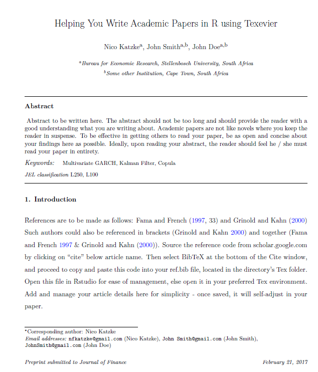

Introduction
============

This package helps a user set up an Elsevier template for writing academic journal reports in Rmarkdown. The setup requires very few lines of code and will get you up and running in *a few seconds* (provided you have all the relevent dependencies installed - see below), with a fully working and good-to-go template.

Using Texevier you can simply start writing your paper / thesis / phd in R, with a template guiding you through the most important aspects you will encounter in your writing. Your template will look as follows:

Dependencies Required
---------------------

Make sure you have the following installed on your computer:

-   [R](http://cran.r-project.org/bin/windows/base/)
-   [Rstudio](http://www.rstudio.com/)

Optional (Should be installed automatically)
--------------------------------------------

-   [MikTex](http://miktex.org/download)

Code
----

After installing all three at the top, simply run the following code:

    if (!require("devtools")) install.packages("devtools")
    library(devtools)
    devtools::install_github("Nicktz/Texevier")
    library(Texevier)
    # Input your directory as dir:
    dir <- "YOUR DIRECTORY HERE"
    create_template(directory = dir, template_name = "Template", launch_template = TRUE, ShowPDFatLaunch = TRUE)

This will automatically install all the needed files and components, and allow you to start working with an Elsevier template in less than a minute. A pdf will pop up, if you keep ShowPDFatLaunch = TRUE, which you can scroll through to see what your template looks like. REMEMBER to close the pdf before attempting to edit the template. Conversely, set ShowPDFatLaunch = FALSE. By default your template R files will be launched. To only create the folder, set launch\_template = FALSE.

A template.Rmd file will also be opened automatically from the directory provided, which contains all the needed notes on how to write an academic paper in R to produce the pdf example shown. I recommend going through the code in depth for a good reference before you start working. Also, start your paper journey by creating a R.proj within your working folder.

Motivation
----------

Doing research in R allows you to verify your work easily. This template is designed to save the researcher time in terms of setting up a proper template for doing formal research. This is something which could feel daunting and can be time-consuming for even intermediate LaTeX and R users. This package is intended to get you started in less than a minute.

Feel free to edit the templates and use this as a starting point for your own research.

Thanks to [Hanjo Odendaal](https://github.com/HanjoStudy) for adding some valuable code in the template creator as well.
